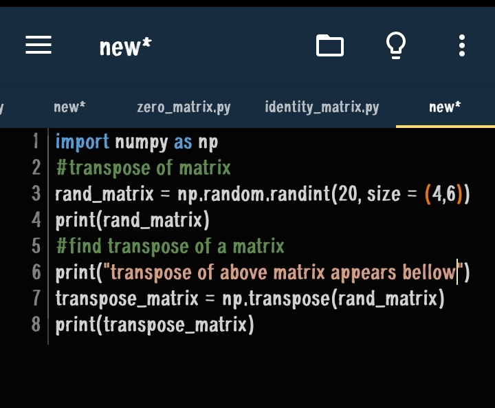
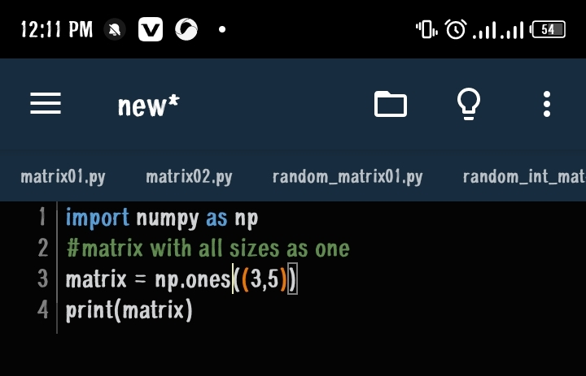

Matrixes are list of numbers arranged in rows and columns in specific arrangements called size or shapes.
For me to implement concepts of matrices, I used numpy library.

Cheetsheet attached in the parent folder.

1. Using numpy lib to create matrices
Used 

2. Creating a matrices with random integer same as random floating point numbers suing `randint()`

3. Transpose matrices 

4. Identity matrices 

5. Zero or null matrices

6. ones matrices 
This can be done using `np.omes((shape))`

