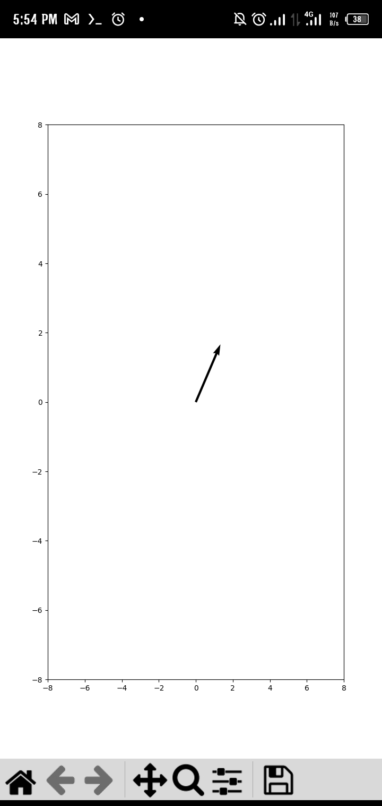
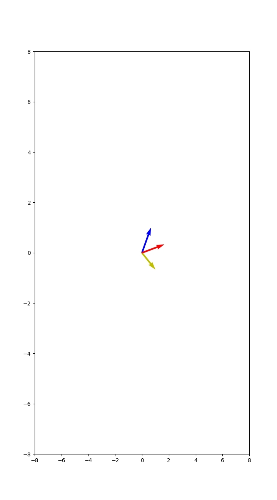
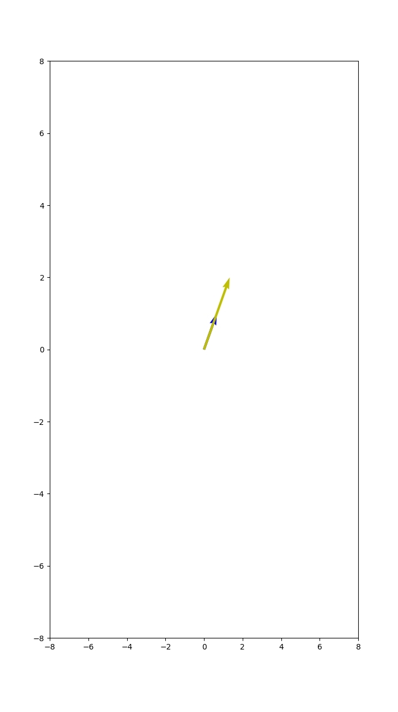
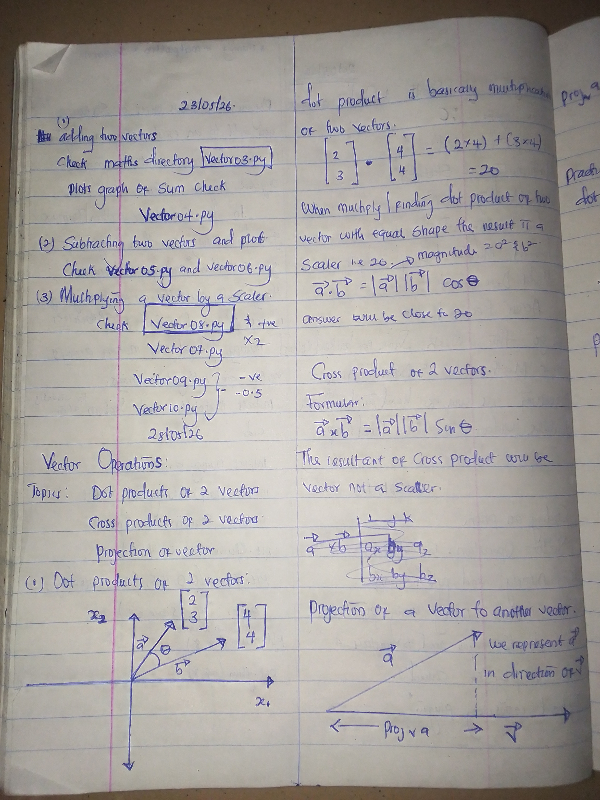

# Vectors Operations

1. **Vector01.py** - using numpy, matplotlib and seaborn to plot graph for two vectors (x and y)

2. **Vector02.py** - Plot of a positive vector and a negative vector

3. **vector04.py** - Plots of adding vectors

4. **Vector06.py** - Plots of subtracting vectors

5. **vector08.py** - Multiplying a vector by a scaler

Positive x 2:

Negative -0.5:

Notes: 

